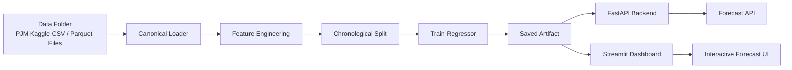

# <div align="center">⚡ PJM Hourly Energy Forecasting</div>

<div align="center">

<p>
  
  
  
  
  
  
</p>

<p>
  
  
  
  
</p>

</div>

<p align="center">
  Forecast hourly electricity demand across PJM regions using a canonical long-form dataset, rich time-series feature engineering, a reusable saved artifact, and both API and dashboard interfaces.
</p>

---

## Overview

This project forecasts hourly electricity consumption from the Kaggle PJM dataset. It normalizes multiple source files into one canonical table, engineers time-aware and region-aware features, trains a regression baseline, and exposes forecasts through:

- a FastAPI backend
- a Streamlit dashboard
- reusable model artifacts saved to disk

The current implementation is optimized for clarity, correctness, and end-to-end reproducibility.

### What it solves

- Demand forecasting for smart grids and energy planning
- Peak-load anticipation for buildings, facilities, and regions
- Simple deployment path for demos, portfolios, and academic projects

---

## Highlights

- Canonical data pipeline built around `Datetime`, `Region`, and `Load`
- Rich feature engineering for hourly load patterns
- Multi-region support with single-region and all-region forecast modes
- Chronological evaluation split with training-fold shuffling only
- Persisted model artifact and training outputs
- FastAPI endpoint for programmatic access
- Streamlit UI for interactive forecasting

---

## Architecture



---

## Repository Layout

```text
.
├── backend/
│   └── main.py              # FastAPI application
├── data/                    # Kaggle PJM hourly datasets
├── frontend/
│   └── app.py               # Streamlit dashboard
├── models/
│   └── pjm_forecasting_artifact.joblib
├── outputs/
│   ├── evaluation_plot.png
│   ├── feature_importance.csv
│   └── training_metrics.json
├── src/
│   ├── pipeline.py          # Canonical loader, features, training, forecasting
│   ├── data_loader.py
│   ├── features.py
│   ├── forecast.py
│   └── train.py
├── main.py                  # CLI training entrypoint
└── requirements.txt
```

---

## Data

The repository currently uses the Kaggle PJM hourly consumption family of datasets found in `data/`.

### Supported source formats

- Per-region hourly CSV files
- Combined wide-table hourly file
- Parquet-style wide file with `Datetime` as an index

### Canonical schema

All sources are normalized into a single long-form table:

- `Datetime`
- `Region`
- `Load`

### Included regions

- AEP
- COMED
- DAYTON
- DEOK
- DOM
- DUQ
- EKPC
- FE
- NI
- PJME
- PJMW
- PJM_Load

---

## Feature Engineering

The training pipeline creates a rich, region-aware feature matrix.

### Calendar features

- `hour`
- `day`
- `dayofweek`
- `dayofyear`
- `weekofyear`
- `month`
- `quarter`
- `year`

### Binary flags

- `is_weekend`
- `is_month_start`
- `is_month_end`
- `is_quarter_start`
- `is_quarter_end`
- `is_peak_hour`
- `is_holiday`
- `is_business_day`

### Cyclical encodings

- `hour_sin`, `hour_cos`
- `dayofweek_sin`, `dayofweek_cos`
- `month_sin`, `month_cos`
- `dayofyear_sin`, `dayofyear_cos`
- `weekofyear_sin`, `weekofyear_cos`

### Lag features

Per region lag features are created for:

- 1 hour
- 2 hours
- 3 hours
- 24 hours
- 48 hours
- 168 hours

### Rolling features

Per region rolling statistics are computed over:

- 3 hours
- 24 hours
- 168 hours

For each window, the pipeline includes:

- rolling mean
- rolling standard deviation
- rolling minimum
- rolling maximum

### Trend and ratio features

- lag-to-lag deltas
- rolling mean deltas
- rolling std deltas
- lag ratios
- rolling mean ratios

### Region identity

The pipeline also includes one-hot encoded region identifiers so the model can learn cross-region structure.

---

## Model Strategy

This project currently uses a strong, dependency-light regression baseline built on NumPy. It was chosen so the repository remains runnable in this environment without relying on incompatible binary packages.

### Training behavior

- Canonical data is sorted by `Region` and `Datetime`
- Feature rows are built from historical context only
- Evaluation uses rolling-window walk-forward validation
- Each fold forecasts recursively from the current origin
- The final deployment model is trained after validation on the full dataset

### Saved artifact

The model is saved to:

```text
models/pjm_forecasting_artifact.joblib
```

The artifact stores:

- trained model
- feature column order
- metadata needed for inference

---

## Quick Start

### 1. Create a virtual environment

```bash
python -m venv .venv
.venv\Scripts\activate
```

### 2. Install dependencies

```bash
pip install -r requirements.txt
```

### 3. Train the model

```bash
python main.py
```

This will:

- load and normalize the data
- engineer features
- train the model
- save the artifact in `models/`
- write metrics and plots to `outputs/`

---

## Run the API

Start the FastAPI backend:

```bash
uvicorn backend.main:app --reload
```

### Available endpoints

#### `GET /`
Returns a basic summary of the API, dataset size, available regions, and feature count.

#### `GET /health`
Simple health check.

#### `GET /regions`
Returns the list of supported regions.

#### `POST /forecast`
Generates forecasts.

Request body:

```json
{
  "region": "AEP",
  "horizon": 24
}
```

Use `"region": null` to forecast all regions at once.

### Forecast response

The API returns:

- `mode`
- `requested_region`
- `horizon`
- `forecast_rows`

Each forecast row includes:

- `Datetime`
- `Region`
- `Predicted_Load`

---

## Run the Dashboard

Launch the Streamlit frontend:

```bash
streamlit run frontend/app.py
```

### Dashboard features

- region selector
- all-regions mode
- forecast horizon slider
- forecast chart
- downloadable CSV export

---

## Training Outputs

After training, the pipeline writes:

- `models/pjm_forecasting_artifact.joblib`
- `outputs/training_metrics.json`
- `outputs/feature_importance.csv`
- `outputs/evaluation_plot.png`
- `outputs/walk_forward_backtest_predictions.csv`

### Metrics file

`training_metrics.json` contains:

- walk-forward MAE, RMSE, and R2
- persistence baseline MAE, RMSE, and R2
- fold-by-fold backtest summaries
- final fit row count
- feature count
- regions covered

---

## Example Usage

### Train from Python

```python
from src.data_loader import load_all_data
from src.train import train_model

df = load_all_data()
rmse, r2, preds, y_test = train_model(df)
print(rmse, r2)
```

### Forecast a single region

```python
from src.data_loader import load_all_data
from src.forecast import forecast_next

df = load_all_data()
forecast = forecast_next(df, region="AEP", horizon=24)
print(forecast.head())
```

### Forecast all regions

```python
from src.data_loader import load_all_data
from src.forecast import forecast_next

df = load_all_data()
all_region_forecasts = forecast_next(df, horizon=24)
for region, frame in all_region_forecasts.items():
    print(region)
    print(frame.head())
```

---

## Design Notes

- The repo is structured to be readable by reviewers, recruiters, and collaborators.
- The backend and frontend both consume the same artifact and preprocessing assumptions.
- The data pipeline intentionally avoids future leakage in evaluation.
- Forecasts are generated iteratively so lag-based features remain valid across the horizon.

---

## Troubleshooting

### `Model artifact not found`

Run:

```bash
python main.py
```

### API returns no forecasts

Ensure the model artifact exists in `models/` and that the data folder contains the PJM files.

### Dashboard cannot reach the API

Start the backend first:

```bash
uvicorn backend.main:app --reload
```

### Import or environment issues

Reinstall the dependencies inside a clean virtual environment:

```bash
pip install -r requirements.txt
```

---

## Roadmap

- add richer model comparisons
- add automated backtesting
- add Docker deployment
- add CI checks for smoke tests
- add forecast confidence intervals

---

## License

This project is intended for academic, portfolio, and prototyping use. Add a formal license file if you plan to distribute it publicly.

---

<div align="center">
  <strong>Built for smart grids, climate-tech workflows, and clean AI forecasting demos.</strong>
</div>
